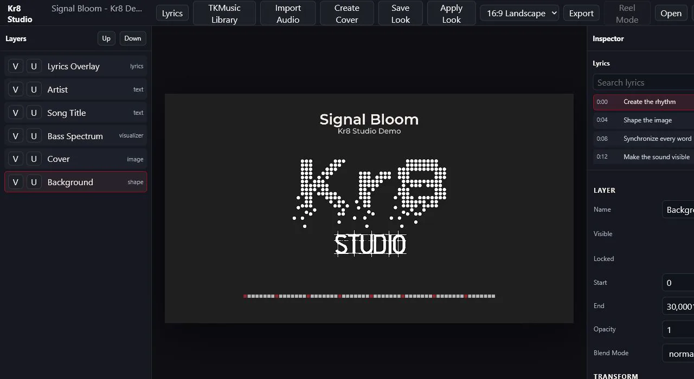
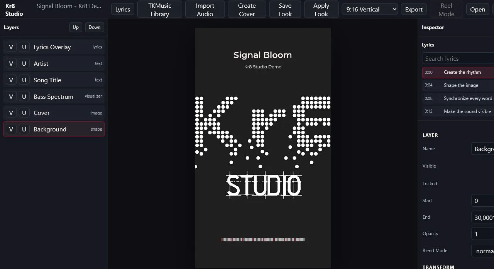
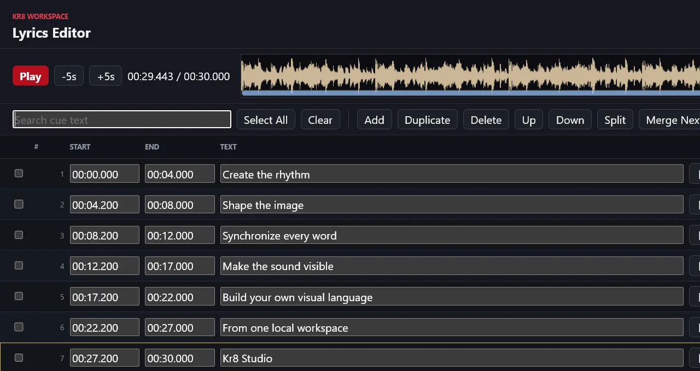
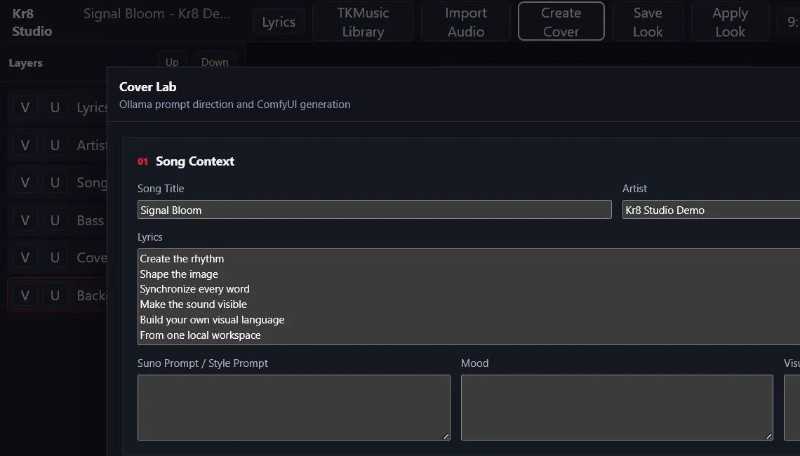
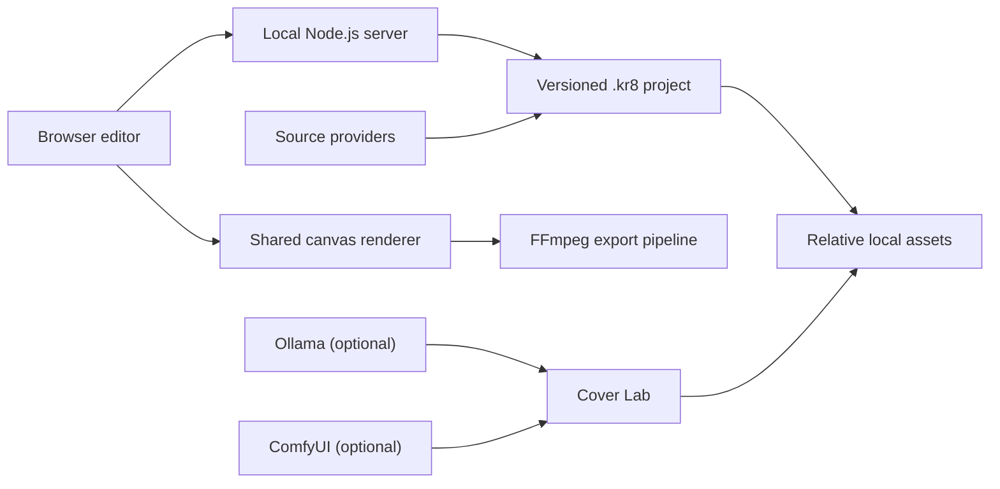

# Kr8 Studio



**Local-first music visualizer and lyric video editor.**

Import a song, compose a cover, synchronize lyrics, build audio-reactive visuals, and export a finished music video from one local workspace.

> **Project status:** active pre-release development. Project files are versioned, but interfaces and presets may still evolve.

Kr8 Studio is a desktop/local-first editor served by a small Node.js process. The editor works with ordinary local audio, cover images, SRT/LRC lyrics, and self-contained `.kr8` project folders. TKMusic is an optional source provider, not a core requirement. Ollama and ComfyUI are optional Cover Lab integrations.

## Highlights

- Local audio import: MP3, WAV, FLAC, M4A, AAC, and OGG.
- PNG, JPG, JPEG, and WebP cover import.
- SRT and LRC import plus a cue-level Lyrics Editor.
- Waveform, seekable timeline, sections, volume, and mute controls.
- Audio-reactive bar and radial visualizers with reusable presets.
- 16:9, 9:16, and 1:1 composition formats.
- Ordered layer system with visibility, lock, duplicate, rename, and inspector controls.
- Advanced typography, local system fonts, text effects, and texture-backed text.
- Save Look / Apply Look project templates.
- PNG frame export and MP4 export through FFmpeg.
- Raw RGBA and headless export modes, including FFmpeg cover-video compositing.
- Cover Lab with optional Ollama prompt generation and ComfyUI image generation.
- Local server mode, mobile workspace, and optional publishing providers.
- Optional TKMusic library adapter.

## Screenshots

| Landscape project | Vertical project |
| --- | --- |
|  |  |

| Lyrics Editor | Cover Lab |
| --- | --- |
|  |  |

More views are available in [`docs/screenshots/`](docs/screenshots/).

## Architecture



The project engine, layer model, lyrics engine, analyzer, visualizer, renderer, and exporter are source-provider agnostic. Providers adapt external sources into the common project schema. See [Architecture](docs/architecture.md) and [Project Format](docs/project-format.md).

## Requirements

- Node.js **26.4.0 or newer**
- npm (included with Node.js)
- FFmpeg and FFprobe for media probing and video export
- A Chromium-based browser for the editor
- Optional: Chromium/Chrome executable for headless export
- Optional: Ollama for Cover Lab prompt generation
- Optional: ComfyUI plus a compatible API workflow for Cover Lab generation

Kr8 has no native npm dependencies, does not use SQLite, and does not require Tauri.

## Quick Start

```bash
git clone https://github.com/zeeoale/Kr8_Studio.git
cd Kr8_Studio
npm install
npm run demo:prepare
npm run dev
```

Open [http://127.0.0.1:5174](http://127.0.0.1:5174). The default public demo is:

```text
examples/kr8-demo-landscape.kr8/project.json
```

Use **Open** to select a different `.kr8/project.json`, including the vertical demo.

## Installation

1. Install Node.js and verify it with `node --version`.
2. Install FFmpeg and verify both `ffmpeg -version` and `ffprobe -version`.
3. Run `npm install`.
4. Copy `.env.example` to `.env.local` only when custom paths or optional providers are needed.
5. Run `npm run dev`.

Kr8 starts without TKMusic, Ollama, ComfyUI, publisher credentials, or a GPU.

## Development

```bash
npm run dev
npm run lint
npm test
npm run build
npm run audit:public
```

`npm run lint` performs syntax validation across the current JavaScript modules. `npm run build` assembles a clean runtime in `dist/`; it is not a transpilation step.

## Production Build

```bash
npm run build
cd dist
npm install --omit=dev
npm start
```

For a controlled network deployment, copy `.env.server.example` to an untracked environment file and review [Server Mode](docs/server-mode.md). Binding beyond loopback requires authentication, firewall rules, and a trusted private network or reverse proxy.

## Importing Audio

Use **Open > New from Local Audio** and select a supported file. Kr8 copies the source into the project, probes real duration and codec with FFprobe, generates a browser-compatible proxy only when required, and leaves the original file untouched.

See [Audio Import](docs/audio-import.md).

## Importing Covers

Select the Cover layer and choose **Import Cover**. Kr8 accepts PNG, JPG, JPEG, and WebP, copies the file into the project asset directory, updates the asset registry, and preserves the source file.

## Importing SRT or LRC

Open **Lyrics**, then import SRT or LRC. The Lyrics Editor validates timestamps, keeps stable cue IDs, supports cue edits and batch shifts, and writes a controlled `assets/lyrics.kr8.json` document.

See [Lyrics Editor](docs/lyrics-editor.md).

## Typography

Text and lyrics layers support system fonts, sizing, line height, tracking, alignment, strokes, shadows, fills, textures, transforms, and advanced line layout. Decorative glyph overflow is measured with actual canvas bounding boxes where available so display fonts remain faithful in preview and export.

See [Advanced Typography](docs/advanced-typography.md).

## Visualizers

Visualizer layers use browser-side analysis for preview and deterministic offline audio frames for export. Frequency reduction uses perceptual mapping and configurable range, gain, sensitivity, floor, high-frequency boost, smoothing, and per-band response.

## Cover Lab

Cover Lab stores generation settings with the project and can:

- create image prompts through a selected local Ollama model;
- patch a user-supplied ComfyUI API workflow;
- submit jobs and retrieve generated images;
- import a selected result as a normal Kr8 cover asset.

No model or ComfyUI workflow is bundled. The editor remains usable when either service is offline and reports the missing service or workflow clearly.

See [Cover Lab](docs/cover-lab.md), [Ollama](docs/ollama.md), and [ComfyUI](docs/comfyui.md).

## Export Pipeline

Kr8 can capture PNG frames, encode MP4 with FFmpeg, mux the project audio, and tag SDR H.264 output as BT.709 limited-range `yuv420p`. Raw RGBA and headless paths avoid large frame directories; cover-video projects use FFmpeg compositing for deterministic performance.

See [Export](docs/export.md).

## Supported Formats

| Purpose | Formats |
| --- | --- |
| Audio import | MP3, WAV, FLAC, M4A, AAC, OGG |
| Cover image | PNG, JPG, JPEG, WebP |
| Cover video | MP4, WebM, MOV |
| Lyrics exchange | SRT, LRC, timestamped text |
| Project | `.kr8/project.json` plus relative assets |
| Export | PNG frames, H.264 MP4 |

Actual browser decoding support can vary. Kr8 creates an audio playback proxy when a source codec is not reliably browser-decodable.

## Project Structure

```text
examples/my-song.kr8/
  project.json
  assets/
    audio/
    lyrics.kr8.json
  exports/               # ignored by Git
```

Project assets use forward-slash relative paths. Base64 media is not stored in `project.json`.

## Configuration

Copy `.env.example` to `.env.local`. Important variables include:

| Variable | Purpose | Safe default |
| --- | --- | --- |
| `KR8_HOST` | Bind host | `127.0.0.1` |
| `KR8_PORT` | Editor port | `5174` |
| `KR8_TRUSTED_ORIGINS` | Exact opt-in VPN/proxy origins | unset |
| `KR8_FFMPEG_PATH` | Explicit FFmpeg executable | `ffmpeg` on PATH |
| `KR8_FFPROBE_PATH` | Explicit FFprobe executable | `ffprobe` on PATH |
| `KR8_BROWSER_PATH` | Chromium executable for headless export | auto-detected |
| `KR8_PROJECTS_ROOT` | Approved root for project selection and access | inferred safely |
| `KR8_TKMUSIC_LIBRARY_ROOT` | Optional TKMusic library | unset |
| `KR8_OLLAMA_URL` | Optional Ollama endpoint | loopback |
| `KR8_COMFYUI_URL` | Optional ComfyUI endpoint | loopback |
| `KR8_COVER_WORKFLOW_PATH` | User-supplied ComfyUI API workflow | unset |

Publisher variables are documented in `.env.example`. Never commit `.env.local`, OAuth downloads, access tokens, or credential stores.

## Optional Source Providers

- **Local Files:** built in and independent of TKMusic.
- **[TKMusic](https://github.com/zeeoale/TKMusic):** optional library browsing and import when a library root is configured.
- **ACE-Step:** documented placeholder.
- **YouTube source:** documented placeholder for authorized source workflows only.

Publisher integrations are separate from source providers. TikTok, YouTube, and Instagram publishing require explicit credentials and user action. The Instagram provider optionally uses the separately deployed [`bridge/instagram-media-bridge/`](bridge/instagram-media-bridge/).

## Troubleshooting

- FFmpeg not found: set `KR8_FFMPEG_PATH` and `KR8_FFPROBE_PATH`.
- Cover Lab offline: verify the optional endpoint, then refresh models or retry.
- Headless export unavailable: set `KR8_BROWSER_PATH` to Chrome or Chromium.
- Port already in use: set `KR8_PORT` to another free port.
- Browser media mismatch: reload after import and verify the project asset path is relative.

See [Troubleshooting](docs/troubleshooting.md).

## Privacy and Security

Editing is local. Kr8 has no implicit telemetry and performs no automatic media upload. Ollama and ComfyUI default to loopback. Publishing happens only after explicit configuration and user action. Treat imported media as untrusted and keep FFmpeg current.

The public default binds only to `127.0.0.1`, including `--server` mode. Binding to `0.0.0.0` or another interface must be explicit and does not by itself authorize browser access: configure exact `KR8_TRUSTED_ORIGINS`, authentication, a trusted VPN, and firewall rules. Project and asset access is restricted to canonical approved roots; the browser opens projects by root-relative identifier rather than arbitrary filesystem path.

The scripts under `deploy/windows/` are an advanced private deployment option. They are not run by installation or `npm start`, and the SYSTEM task installer requires explicit risk acknowledgement, protected executable files under `Program Files`, and mutable data under `ProgramData`.

See [Privacy](docs/privacy.md), [Security Policy](SECURITY.md), [Threat Model](THREAT_MODEL.md), and [Windows deployment](docs/windows-service.md).
The current sanitization and release-readiness results are recorded in the
[Public Release Audit](docs/PUBLIC_RELEASE_AUDIT.md).

## Roadmap

- Complete provider-independent project creation UX.
- Improve mobile editing parity.
- Add safer project migration and recovery tooling.
- Expand deterministic visualizer and typography tests.
- Package optional workflows only after their redistribution rights are documented.
- Stabilize the contributor-permission process for dual licensing.

## Contributing

Read [CONTRIBUTING.md](CONTRIBUTING.md) before opening a pull request. Do not include protected music, private projects, credentials, AI models, or generated exports.

## License

Kr8 Studio source code is licensed under the
[GNU Affero General Public License v3.0 or later](LICENSE).

If you modify Kr8 Studio and make the modified software available to users over
a network, you must provide those users access to the corresponding source code
as required by the AGPL.

The AGPL permits commercial use. A separate commercial license may be available
for organizations that want proprietary integration, closed-source
distribution, white-label use, or hosted deployment without complying with
AGPL obligations. See [Commercial Licensing](COMMERCIAL-LICENSE.md).

The software license does not grant rights to Kr8 Studio, TKMusic, or Takara
branding. Demo media, screenshots, official artwork, and project assets can
have separate terms. See [Trademarks](TRADEMARKS.md),
[Asset License](ASSET-LICENSE.md), and [Notice](NOTICE).

## Acknowledgements

- FFmpeg and FFprobe for media processing.
- MP4Box.js for MP4 parsing.
- Undici for standards-based HTTP support in Node.js.
- Ollama and ComfyUI as optional local integrations.
- [TKMusic](https://github.com/zeeoale/TKMusic) as the first official optional source provider.
- Astrofox as an architectural reference during early assessment; no full Astrofox fork is included.
