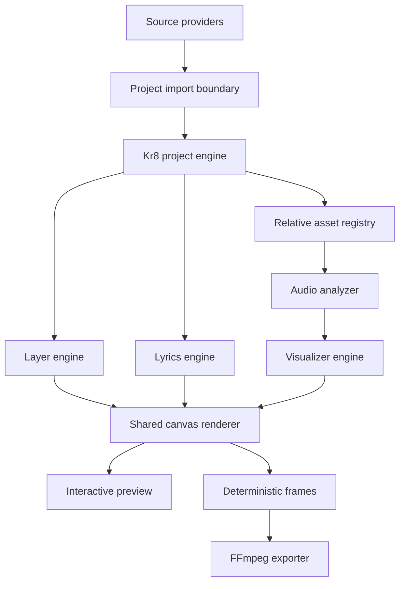

# Architecture

Kr8 Studio is a local-first Node.js application with a browser editor. Its core data model is independent from the UI, renderer, and external music libraries.

## Boundaries

- `src/project`: schema, serialization, migrations, project creation, and file selection.
- `src/layers`: provider-independent layer operations.
- `src/assets`: controlled local imports and relative path handling.
- `src/audio`: waveform, analysis, and frequency mapping.
- `src/lyrics` and `src/lyrics-editor`: cue timeline, rendering, validation, and exchange.
- `src/visualizer`: styles, presets, and renderer-facing configuration.
- `src/editor`: local HTTP server and browser client.
- `src/exports`: frame, raw RGBA, headless, and FFmpeg export paths.
- `src/source-providers`: adapters that produce ordinary Kr8 projects.
- `src/cover-lab`: optional Ollama and ComfyUI clients.
- `src/publish`: isolated opt-in publishing providers and credential storage.

## Provider Independence

The core does not understand Suno track IDs, TKMusic directory names, or provider metadata formats. `TKMusicProvider` owns those concepts. `LocalFilesProvider` creates projects from ordinary audio, optional cover art, and optional lyrics. Placeholder providers declare capabilities without pretending to implement import.

## Rendering

Preview and export share layer semantics. Preview reads live Web Audio data. Export generates deterministic audio frames and draws the same project state at explicit timestamps. FFmpeg receives either frames/raw RGBA or a composited stream, then muxes the selected song asset.

## Storage

A project is a directory containing `project.json` and relative assets. Media is never Base64-embedded. Unknown project fields are retained by editor operations whenever possible. Runtime credentials and publisher tokens live outside projects.

## Optional Services

Ollama and ComfyUI are accessed only from Cover Lab. They are not startup dependencies. Publisher APIs are similarly isolated: editor, preview, and export remain available without provider credentials.
